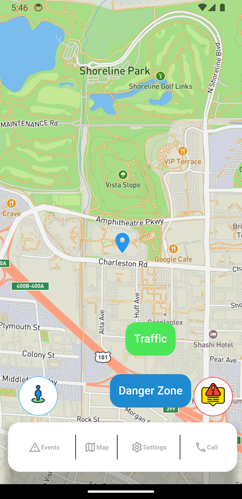
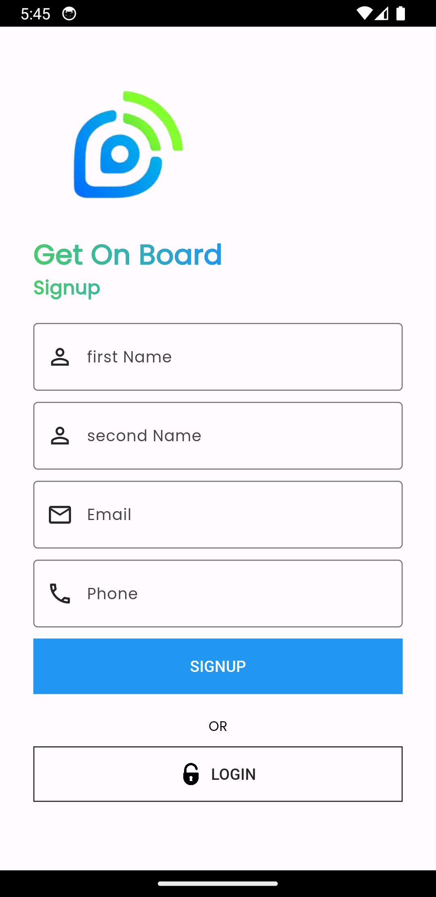

# Trafic_app

**Traffic Application**

Trafic_app is a Flutter application that allows users to open a map and check for traffic or other events happening on their route. Users can select a main route and receive notifications if that route has an event or traffic. Additionally, everyone can post an event or report traffic.

## Features

- **Map Integration**: View your current location on a map.
- **Traffic and Event Alerts**: Get real-time notifications about traffic or events on your selected route.
- **User-Generated Reports**: Post events or traffic updates for other users.
- **Route Selection**: Choose a main route and get updates specific to that route.
- **Events Page**: View a list of recent events or traffic reports posted by users.
- **Edit Profile Page**: Update your personal information, including your name, email, and profile picture.
- **Login and Sign-in**: Secure authentication system to create an account or log in to an existing one.

## Screenshots

- **Main Map Screen**


  

- **Sign-in Screens**

    


## Installation

To use this application, follow these steps:

1. **Clone the repository:**

   ```bash
   git clone https://github.com/usfbelhadj/Traffic_app
   ```

2. **Clone the repository:**

   ```bash 
   cd traffic_app
   ```

3. **Install the dependencies:**

   ```bash
   flutter pub get
   ```

4. **Run the application:**
   ```bash
   flutter run
   ```


## Usage

### 1 - Open the application.

### 2 - Allow location permissions.

### 3 - View your current location on the map.

### 4 - Select a main route to monitor.

### 5 - Receive notifications for any events or traffic on your selected route.

### 6 - Post events or traffic updates for other users to see.

### 7 - Navigate to the Events Page to view recent user-generated reports.

### 8 - Edit your profile information on the Edit Profile Page.

### 9 - Log in or create a new account using the Login and Sign-in screens.


